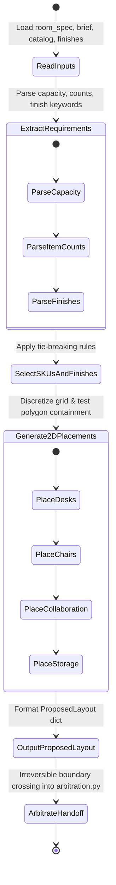

# RuleBound Deterministic Generator Engine Design

## 1. Purpose

The **Generator Engine** (`src/generator.py`) is the initial proposal layer of RuleBound. It reads plain-English customer briefs (`briefs/ROOM-*.txt`), room geometry specifications (`rooms/ROOM-*.json`), catalog items (`catalog.json`), finish definitions (`finishes.json`), and rules (`rules.json`) to construct an initial candidate placement proposal (`ProposedLayout`).

The generator is purely a proposal engine. It bridges the gap between unstructured text/spec inputs and structured 2D coordinate layouts without performing final rule enforcement, arbitration, or pricing.

---

## 2. Generator Responsibilities

The generator is strictly responsible for:
1. Parsing room specifications and plain-English briefs to extract explicit quantitative requirements (seating capacity, furniture counts) and finish preferences.
2. Selecting compatible catalog SKUs and valid finish IDs for each required product family deterministically.
3. Determining exact item quantities per product family based on brief directives and room capacity.
4. Computing initial top-down 2D coordinates $(x, y)$ and rotation angles ($\theta \in \{0^\circ, 90^\circ, 180^\circ, 270^\circ\}$) for each item, placing them inside room polygon boundaries while attempting to avoid obvious door and egress path obstructions.
5. Outputting a single, schema-compliant `ProposedLayout` contract object to hand over **irreversibly** to `arbitration.py`.

---

## 3. Generator Non-Responsibilities

The generator is explicitly **NOT** responsible for:
- Declaring candidate layouts valid or guaranteeing zero constraint violations.
- Performing final rule validation (reserved exclusively for `src/constraints.py`).
- Performing arbitration or spatial repair loops (reserved exclusively for `src/arbitration.py`).
- Calculating pricing, assembly labour, freight, or generating quotes (reserved exclusively for `src/pricing.py`).
- Calling external network APIs, neural models, or LLMs.
- Inventing unstated business rules or claiming generator positioning heuristics are official RuleBound constraints.

---

## 4. Input Contract

The generator function `generate_proposal()` accepts the following typed arguments:

```python
from typing import Any, Dict, List, Optional

def generate_proposal(
    room: Dict[str, Any],
    brief_text: str,
    catalog: List[Dict[str, Any]],
    finishes: List[Dict[str, Any]],
    rules: List[Dict[str, Any]],
    historical_jobs: Optional[List[Dict[str, Any]]] = None
) -> Dict[str, Any]:
    ...
```

- `room`: Dictionary representing `room_spec.json` (`room_id`, `boundary_mm`, `capacity`, `doors`, `windows`, `zones`, `fixed_fixtures`, `finish_rules`).
- `brief_text`: String containing the plain-English customer brief (`briefs/ROOM-*.txt`).
- `catalog`: List of catalog item dictionaries (`sku`, `name`, `family`, `dimensions_mm`, `list_price_inr`, `compatible_finish_ids`, `assembly_labour_minutes`).
- `finishes`: List of finish dictionaries (`finish_id`, `name`, `uplift_bps`, `compatible_families`).
- `rules`: List of rule dictionaries from `rules.json`.
- `historical_jobs`: Optional list of historical job dictionaries from `historical_jobs.json`.

---

## 5. Requirement Extraction

### 5.1 Classification of Requirements

| Requirement | Source | Category | Machine-enforced here? |
| :--- | :--- | :--- | :--- |
| **Seating Capacity** | `room_spec.capacity` / Brief ("12-person", "10-person") | Explicit Quantitative | **Yes** (Generates required chair count) |
| **Storage Unit Count** | Brief ("two lockable storage units") | Explicit Quantitative | **Yes** (Generates 2 storage units) |
| **Collaboration Table Count** | Brief ("one compact collaboration table") | Explicit Quantitative | **Yes** (Generates 1 collaboration table) |
| **Finish Preference** | Brief ("natural oak and graphite") | Explicit Qualitative | **Yes** (Matches finish keywords) |
| **Visual Openness** | Brief ("keep the room visually open") | Qualitative Guidance | **No** (Heuristic spacing only) |
| **Circulation / Focus** | Brief ("quiet focus library", "generous route") | Qualitative Guidance | **No** (Heuristic clearance only) |

### 5.2 Deterministic Parsing Logic & Qualitative Guidance Boundary
- **Capacity Extraction**: Extracted from `room_spec["capacity"]`. If brief text contains explicit capacity patterns (e.g. `r"(\d+)-person"`, `r"team of (\d+)"`), the extracted integer is validated against `room_spec["capacity"]`.
- **Furniture Quantities**: Extracted via keyword regex:
  - `r"(one|two|three|four|\d+)\s+(lockable\s+)?storage"` $\to$ Storage quantity.
  - `r"(one|two|three|four|\d+)\s+collaboration"` $\to$ Collaboration table quantity.
  - `r"(one|two|three|four|\d+)\s+touchdown"` $\to$ Touchdown table quantity.
- **Finish Keyword Mapping**: Brief text is searched for finish names (e.g., "oak" $\to$ `F01`, "graphite" $\to$ `F02`, "white" $\to$ `F03`, "walnut" $\to$ `F05`).
- **No Undocumented Numerical Interpretations**: Qualitative brief phrases ("visually open", "quiet focus", "generous route") are **never** converted into undocumented numerical offset formulas or arbitrary pixel margins. They represent qualitative design context only.

---

## 6. SKU Selection Algorithm

For each required product family (`desk`, `chair`, `storage`, `collaboration`, `accessory`):

1. **Family Filter**: Filter `catalog.json` items where `item["family"] == required_family`.
2. **Finish Compatibility Filter**: Retain SKUs where the chosen `finish_id` is in `item["compatible_finish_ids"]`.
3. **Deterministic Tie-Breaking**: If multiple SKUs remain valid, rank candidates using a strict tie-breaking tuple:
   $$\text{RankKey} = (\text{FootprintArea}, \text{list\_price\_inr}, \text{sku})$$
   - Primary: Smallest footprint area ($\text{width} \times \text{depth}$).
   - Secondary: Lowest `list_price_inr`.
   - Tertiary: Alphabetical SKU string sort (`sku`).

| Generator Decision | Deterministic Rule | Tie-Break Order |
| :--- | :--- | :--- |
| **Desk SKU** | Match family `"desk"`, compatible with finish | Footprint Area $\to$ List Price $\to$ SKU string |
| **Chair SKU** | Match family `"chair"`, compatible with finish | Footprint Area $\to$ List Price $\to$ SKU string |
| **Storage SKU** | Match family `"storage"`, compatible with finish | Footprint Area $\to$ List Price $\to$ SKU string |
| **Collaboration SKU** | Match family `"collaboration"`, compatible with finish | Footprint Area $\to$ List Price $\to$ SKU string |
| **Accessory SKU** | Match family `"accessory"`, compatible with finish | Footprint Area $\to$ List Price $\to$ SKU string |

---

## 7. Quantity Determination

Quantity assignment follows strict deterministic precedence:

1. **Explicit Brief Quantity**: Extracted count from brief text (e.g. "two storage units" $\to 2$; "one collaboration table" $\to 1$).
2. **Mandatory Seating Capacity**: Chair quantity $Q_{\text{chair}} = \text{room\_spec["capacity"]}$.
3. **Workstation Desk Quantity**: For office/studio briefs, desk quantity $Q_{\text{desk}}$ matches seating capacity or paired desk capacity ($Q_{\text{desk}} = \lceil Q_{\text{chair}} / \text{seats\_per\_desk} \rceil$).
4. **Default Fallback**: Optional items unmentioned in brief or spec default to $0$.

---

## 8. Finish Selection Algorithm

Finish selection is deterministic and strict:

1. **Explicit Brief Requirement**: Parse brief text for finish material/color keywords (e.g., "oak", "graphite", "walnut", "beech", "gray"). If a keyword matches a finish compatible with the required product family (`required_family in finish["compatible_families"]`), select that finish.
2. **Objective Cost Fallback**: If no explicit finish keyword exists in the brief (or if the keyword finish is incompatible with the SKU family), select deterministically among all finishes compatible with `required_family`:
   - Primary Objective: Lowest `uplift_bps` (most cost-effective compatible finish).
   - Secondary Tie-Break: Alphabetical string sort on `finish_id`.
3. **Compatibility Invariant**: The generator must **never** select or force an incompatible finish.
4. **Heuristic Status**: Any fallback selection is a generator proposal heuristic, **NOT** an official RuleBound rule.

---

## 9. Top-Down 2D Placement Strategy & Constraint Separation

### 9.1 Separation of Generator Heuristics vs. Constraint Engine
- **Generator Role**: *"Prefers initial candidate positions away from known door and egress regions to construct sensible starting proposal layouts."*
- **Constraint Engine Role**: *"Authoritatively determines whether RB-GEO-002 (egress path), RB-GEO-003 (door swing), or any spatial rules are violated."*
- **Non-Invalidation Principle**: The generator must **never** independently mark a candidate position invalid or throw errors solely because of its positioning buffer. Positioning preferences are used strictly for candidate coordinate ranking.

### 9.2 Coordinate Space & Polygon Boundary Containment
- The generator discretizes the room bounding box into a 100mm grid.
- **Polygon Containment**: Every proposed placement footprint $(x, y, w, d, \theta)$ must have all 4 corners located strictly inside `room_spec["boundary_mm"]` polygon (using deterministic 2D integer point-in-polygon ray-casting).

### 9.3 Positioning Preferences & Candidate Ranking
- Candidate grid coordinates are scored with positioning preferences:
  - Prefer positions $> 850\text{ mm}$ from door centers.
  - Prefer positions $> 1100\text{ mm}$ from marked egress path lines.
- These scores are used to rank initial starting coordinates ($y$ ascending $\to$ $x$ ascending $\to$ preference score). `constraints.py` performs the sole authoritative validation after handoff.

### 9.4 Family Placement Order & Grid Allocation
Placements are generated sequentially in family priority order:
1. **Desks**: Placed in rows or pods along main room axes.
2. **Task Chairs**: Placed adjacent to desks, facing desk fronts.
3. **Collaboration Tables**: Placed in designated collaboration zones or central open space.
4. **Storage Units**: Placed along room perimeter walls.
5. **Accessories**: Placed adjacent to desks or perimeter walls.

---

## 10. Non-Convex / L-Shaped Room Handling (ROOM-03)

For non-convex rooms such as `ROOM-03` (which has a re-entrant corner at $(4200, 4800)$):

1. **Polygon Boundary Ray-Casting**: The generator tests every placement footprint against the exact 6-vertex boundary polygon:
   $$[(0,0), (6000,0), (6000,4800), (4200,4800), (4200,6000), (0,6000)]$$
2. **Cutout Exclusion**: Any candidate position extending into the cutout region ($x > 4200, y > 4800$) evaluates to `False` under polygon containment and is automatically skipped.
3. **Zoned Pod Placement**: Desks in `ROOM-03` are placed in two distinct pods:
   - Pod 1 (Main Leg): $x \in [500, 3800], y \in [1000, 4000]$
   - Pod 2 (North Leg): $x \in [500, 3800], y \in [4800, 5600]$

---

## 11. Historical Jobs Usage Analysis

- `historical_jobs.json` contains line items (`sku`, `finish_id`, `quantity`) from 6 past jobs, but **zero spatial 2D placement coordinates**.
- **Usage Decision**: `historical_jobs.json` is used **only as an optional tie-breaker preference signal** when ranking SKU/finish pairings that are otherwise equal in price and footprint.
- **Strict Guardrails**:
  - Historical jobs are **never** treated as mandatory rules.
  - Historical jobs **never** dictate spatial placement coordinates.
  - Historical jobs **never** override explicit brief requests or `room_spec.capacity`.

---

## 12. Determinism Guarantees

1. **Zero Randomness**: No `random`, `uuid`, timestamp, or network calls.
2. **Canonical Data Structures**: All dict and set iterations are sorted explicitly (`sorted()`).
3. **Environment Independent**: Byte-identical execution across Windows, Linux, and macOS.

---

## 13. ProposedLayout Output Contract

The generator outputs a clean Python dictionary conforming strictly to the `ProposedLayout` handoff contract:

```json
{
  "room_id": "ROOM-01",
  "placements": [
    {
      "placement_id": "P01",
      "sku": "NW-DES-001",
      "finish_id": "F01",
      "x_mm": 1200,
      "y_mm": 2000,
      "rotation_deg": 0
    },
    {
      "placement_id": "P02",
      "sku": "NW-CHA-001",
      "finish_id": "F02",
      "x_mm": 1200,
      "y_mm": 2700,
      "rotation_deg": 180
    }
  ]
}
```

Internal generator metadata (grid scores, regex tokens) is discarded. Only `room_id` and `placements` cross the boundary into arbitration.

---

## 14. Failure Handling

- **Unmatched Brief Terms**: If brief text contains unknown finish keywords, fall back to lowest `uplift_bps` compatible finish.
- **Dense Room Geometry**: If initial placement placement heuristic cannot fit all items without spatial overlap, propose best-effort positions inside boundary. Downstream `arbitration.py` will repair coordinates or perform unsatisfiable escalation.
- **Missing Historical Data**: If `historical_jobs` is empty or None, proceed with catalog tie-breaking.

---

## 15. Testing Strategy

1. **Determinism Test**: Run `generate_proposal()` twice on identical inputs; verify byte-identical output JSON.
2. **Quantity Extraction Test**: Verify brief parser extracts exact quantities for ROOM-01 through ROOM-05.
3. **Polygon Containment Test**: Verify ROOM-03 proposals never place items inside the re-entrant cutout ($x > 4200, y > 4800$).
4. **SKU Selection Test**: Verify smallest footprint / lowest price tie-breaking.
5. **Contract Handoff Test**: Verify output schema conforms to `ProposedLayout` handoff contract.

---

## 16. Example Proposal Generation for `ROOM-01`

- **Input Brief (`ROOM-01.txt`)**: *"Create a 12-person product-design studio with paired desks, ergonomic chairs, two lockable storage units, one compact collaboration table... Prefer natural oak and graphite."*
- **Extracted Quantities**: `capacity = 12` (12 chairs), `storage = 2`, `collaboration = 1`, `desks = 12`.
- **Selected Finishes**: `desk` $\to$ `F01` (Natural Oak, explicit keyword match), `chair` $\to$ `F02` (Graphite Mesh, explicit keyword match), `storage` $\to$ `F01`, `collaboration` $\to$ `F03`.
- **Selected SKUs**:
  - Desk: `NW-DES-001` (1200x600, F01 compatible)
  - Chair: `NW-CHA-001` (600x600, F02 compatible)
  - Storage: `NW-STO-001` (800x450, F01 compatible)
  - Collaboration: `NW-COL-001` (1200x1200, F03 compatible)
- **Generated Coordinates**:
  - Desks `P01`–`P12`: Arranged in paired pods at $y = 1800, 3200$.
  - Chairs `P13`–`P24`: Positioned at desk rear zones.
  - Storage `P25`–`P26`: Positioned along south wall ($y = 200$).
  - Collaboration `P27`: Positioned in east open zone ($x = 5500, y = 3500$).

---

## 17. System State & Data-Flow Diagram


