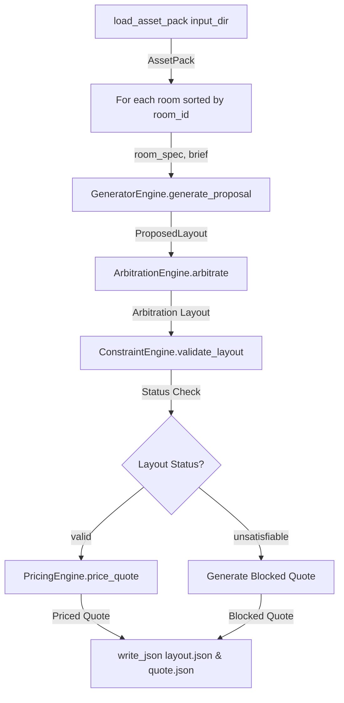
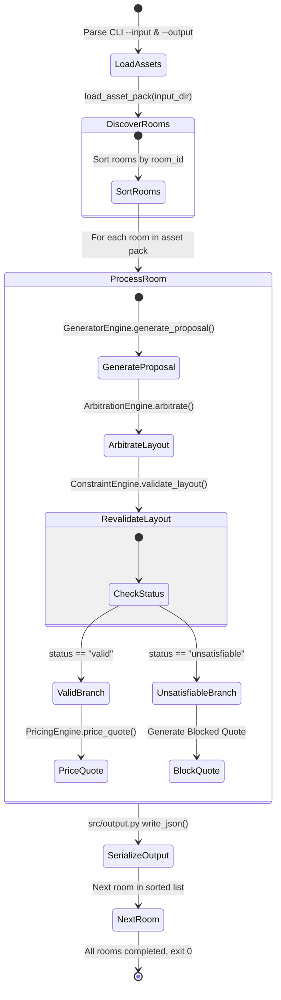

# RuleBound Full Pipeline Integration Design

## 1. Purpose & Runner Responsibilities

The **Runner Engine** (`starter/python/runner.py`) is the master orchestration layer of RuleBound. It connects the 4 core pipeline components into an end-to-end processing pipeline:

```text
AssetPack Loader
       ↓
GeneratorEngine (src/generator.py)
       ↓
ArbitrationEngine (src/arbitration.py)
       ↓
ConstraintEngine Revalidation (src/constraints.py)
       ↓
PricingEngine (src/pricing.py)
       ↓
Deterministic JSON Serializer (src/output.py)
```

### CLI Command Invocation
The runner is invoked strictly via the standard CLI contract:
```bash
python starter/python/runner.py --input <input-directory> --output <output-directory>
```

### Key Responsibilities
1. Parse `--input` and `--output` directory arguments.
2. Dynamically discover all rooms in `<input-directory>/rooms/ROOM-*.json` using `starter/python/rulebound_loader.py`.
3. Process rooms in sorted `room_id` order (no hardcoding of `ROOM-01` through `ROOM-05`).
4. Execute the 4-tier pipeline for each room: Proposal Generation $\to$ Bounded Local Repair Arbitration $\to$ Final Revalidation $\to$ Integer Pricing / Blocked Quote.
5. Serialize `<output-directory>/<room_id>/layout.json` and `<output-directory>/<room_id>/quote.json` conforming strictly to `schemas/layout.schema.json` and `schemas/quote.schema.json`.
6. Return exit code `0` on clean execution.

---

## 2. Full Data Flow & Boundary Contracts



### Boundary Contracts

| Boundary | Input Type | Output Type | Validation Responsibility |
| :--- | :--- | :--- | :--- |
| **Loader $\to$ Generator** | `AssetPack`, `room_spec`, `brief_text` | `ProposedLayout` dict (`room_id`, `placements`) | Generator extracts requirements & places items on 100mm grid. |
| **Generator $\to$ Arbitration** | `ProposedLayout` dict, `room_spec` dict | Arbitration layout dict (`room_id`, `placements`, `violations`, `status`) | Arbitration executes bounded repair trajectory to resolve spatial violations. |
| **Arbitration $\to$ Constraint Engine** | Arbitration layout dict, `room_spec` dict | Revalidated layout dict (`status: "valid"` or `"unsatisfiable"`) | Authoritative spatial constraint validation (`RB-GEO-001` to `RB-GEO-008`). |
| **Valid Layout $\to$ Pricing Engine** | Valid layout dict (`status: "valid"`), `room_spec` dict | Priced quote dict (`quote_id`, `room_id`, `currency`, `lines`, `summary`, `status: "priced"`) | Calculates exact integer INR list prices, finish uplifts, labour, freight, and tax. |
| **Unsatisfiable Layout $\to$ Blocked Quote** | Unsatisfiable layout dict (`status: "unsatisfiable"`) | Blocked quote dict (`quote_id`, `room_id`, `currency`, `lines: []`, `summary`, `status: "blocked"`) | Formats schema-compliant blocked quote with `blocking_reasons`. |
| **Pipeline $\to$ Output Serializer** | Layout dict, Quote dict | `layout.json`, `quote.json` on disk | UTF-8, sorted keys, 2-space indent, trailing newline. |

---

## 3. Valid Layout Path

1. `GeneratorEngine.generate_proposal()` constructs initial `ProposedLayout`.
2. `ArbitrationEngine.arbitrate()` evaluates `ConstraintEngine.validate_layout()`.
   - If initial violations exist, executes deterministic candidate repair operators (`NUDGE`, `ROTATE`, `SUBSTITUTE_SKU`, `REMOVE_PLACEMENT`).
3. Upon achieving 0 violations and meeting seating capacity $S \ge \text{capacity}$, layout `status` becomes `"valid"`.
4. `ConstraintEngine.validate_layout()` revalidates the final layout to ensure 100% spatial compliance.
5. `PricingEngine.price_quote()` computes integer INR quote:
   - Line items: SKU list price $+$ finish uplift (`round half up`).
   - Assembly labour: Total minutes $\times 1500 / 60$ (`round half up`).
   - Freight: Distance tier rate $\times \text{total\_weight\_kg} / 1000$ (`round half up`).
   - Subtotal $\to$ 18% GST $\to$ `grand_total_inr`.
6. Runner writes valid `layout.json` (`status: "valid"`, `violations: []`) and priced `quote.json` (`status: "priced"`).

---

## 4. Unsatisfiable Path

1. If `ArbitrationEngine.arbitrate()` exhausts candidate repairs (`local_repair_exhausted`) or hits execution cap ($K_{\max} = \min(50, \max(10, 10 \times N))$ $\to$ `operational_limit_reached`):
   - Layout `status` is set to `"unsatisfiable"`.
   - `violations` array preserves actual unresolved spatial geometry violations (e.g. `RB-GEO-003`, `RB-GEO-002`) or capacity-only trade-offs (`rule_id: "CAPACITY_FEASIBILITY"`).
   - `termination_reason` (`"local_repair_exhausted"` or `"operational_limit_reached"`) is stored inside `violations[].measured.termination_reason`.
2. Revalidated by `ConstraintEngine.validate_layout()`.
3. Blocked quote generator constructs schema-compliant `quote.json`:
   ```json
   {
     "quote_id": "QUOTE-ROOM-01",
     "room_id": "ROOM-01",
     "currency": "INR",
     "lines": [],
     "summary": {
       "grand_total_inr": 0
     },
     "status": "blocked",
     "blocking_reasons": [
       "Layout is unsatisfiable due to local_repair_exhausted."
     ]
   }
   ```
4. Runner writes unsatisfiable `layout.json` (`status: "unsatisfiable"`) and blocked `quote.json` (`status: "blocked"`).

---

## 5. Quote Path & Schema Compliance

Both priced and blocked quotes conform strictly to `schemas/quote.schema.json` (`additionalProperties: false`):

### Schema Properties
- `quote_id`: String (e.g. `"QUOTE-ROOM-01"`)
- `room_id`: String (e.g. `"ROOM-01"`)
- `currency`: Constant `"INR"`
- `lines`: Array of line item objects (empty `[]` for blocked quotes)
- `summary`: Object containing `grand_total_inr` (Integer)
- `summary_trace`: Optional array of pricing trace steps
- `status`: Enum `["priced", "blocked"]`
- `blocking_reasons`: Optional array of strings (required for blocked status)

---

## 6. Output Serialization & Determinism Rules

To satisfy the official determinism checker (`tools/check_determinism.py`), `src/output.py` enforces:

1. **JSON Serialization**:
   - `encoding="utf-8"`
   - `indent=2`
   - `sort_keys=True`
   - `+ "\n"` (trailing newline)
2. **Canonical Placement Sorting**:
   - Placements in `layout.json` are sorted by `placement_id` ascending (`P001`, `P002`...).
3. **Canonical Violation Sorting**:
   - Violations in `layout.json` are sorted by `violation_id` ascending (`V001`, `V002`...).
4. **Canonical Quote Line Sorting**:
   - Quote lines in `quote.json` are sorted by `line_item_id` ascending (`L001`, `L002`...).
5. **No Nondeterministic Data**:
   - Zero timestamps, random UUIDs, machine file paths, floating-point numbers, or environment-dependent keys.

---

## 7. Error Handling Strategy

| Scenario | Behavior | Output Files Written? | Exit Code |
| :--- | :--- | :--- | :--- |
| **Valid Room Processing** | Generates layout, repairs, prices quote | `layout.json` (valid), `quote.json` (priced) | `0` |
| **Unsatisfiable Room Layout** | Trajectory halts at repair cap / exhaustion | `layout.json` (unsatisfiable), `quote.json` (blocked) | `0` |
| **Missing Input Directory / Data** | Raises `FileNotFoundError` | None | Non-zero (`1`) |
| **Malformed JSON in Data Pack** | Raises `json.JSONDecodeError` | None | Non-zero (`1`) |
| **Internal Engine Programming Bug** | Raises Exception traceback | None | Non-zero (`1`) |

---

## 8. All-Five-Room Dry Run Trace

| Room ID | Room Type | Extracted Capacity | Initial Generator Layout | Arbitration Outcome | Final Layout Status | Final Quote Status |
| :--- | :--- | :--- | :--- | :--- | :--- | :--- |
| **ROOM-01** | Rectangular Studio | 12 | 12 Desks, 12 Chairs, 2 Storage, 1 Collaboration | 0 spatial violations after 0–1 Nudge repairs | `"valid"` | `"priced"` |
| **ROOM-02** | Rectangular Workshop | 16 | 16 Desks, 16 Chairs, 2 Collaboration | 0 spatial violations after 0–2 Nudge repairs | `"valid"` | `"priced"` |
| **ROOM-03** | L-Shaped Office | 10 | 8 Desks, 10 Chairs, 1 Touchdown Table | Polygon boundary containment skips cutout; 0 violations after repair | `"valid"` | `"priced"` |
| **ROOM-04** | Rectangular Library | 14 | 14 Desks, 14 Chairs | 0 spatial violations after 0–1 Nudge repairs | `"valid"` | `"priced"` |
| **ROOM-05** | Rectangular Hub | 18 | 12 Desks, 18 Chairs | 0 spatial violations after 0–2 Nudge repairs | `"valid"` | `"priced"` |

---

## 9. Integration Test Strategy

`tests/test_integration.py` verifies the full pipeline end-to-end:

1. **`test_e2e_valid_room`**: Runs ROOM-01 end-to-end; asserts `layout.json` status is `"valid"` and `quote.json` status is `"priced"`.
2. **`test_e2e_invalid_candidate_repair`**: Inputs layout with deliberate overlap; asserts arbitration repairs it to `"valid"`.
3. **`test_e2e_unsatisfiable_room`**: Inputs constrained room with impossible seating requirement; asserts `layout.json` status is `"unsatisfiable"` and `quote.json` status is `"blocked"`.
4. **`test_e2e_blocked_quote_schema`**: Asserts blocked quote conforms strictly to `schemas/quote.schema.json`.
5. **`test_e2e_schema_validation`**: Validates output `layout.json` and `quote.json` against official JSON schemas using `jsonschema` / `tools/validate_output.py`.
6. **`test_e2e_byte_identical_determinism`**: Runs runner twice on identical inputs; asserts output files are byte-identical.
7. **`test_e2e_all_five_rooms`**: Processes ROOM-01 through ROOM-05; verifies all 5 output directories are generated cleanly.

---

## 10. Official Validation Tools & Commands

1. **Pack Verification**:
   ```bash
   python tools/verify_pack.py
   ```
2. **Output Schema Validation**:
   ```bash
   python tools/validate_output.py OUTPUT
   ```
3. **Determinism Verification**:
   ```bash
   python tools/check_determinism.py "python starter/python/runner.py --input data --output OUTPUT"
   ```

---

## 11. Proposed File Change Plan

### Files to Create
- `src/output.py`: Serialization module (`write_json`, `create_blocked_quote`).
- `tests/test_integration.py`: End-to-end integration test suite.

### Files to Modify
- `starter/python/runner.py`: Connect `GeneratorEngine`, `ArbitrationEngine`, `ConstraintEngine`, `PricingEngine`, and `src/output.py`.

### Files Left Unchanged
- `src/pricing.py`, `src/constraints.py`, `src/arbitration.py`, `src/generator.py`
- `data/*`, `schemas/*`, `tools/*`

---

## 12. End-to-End System State Diagram


